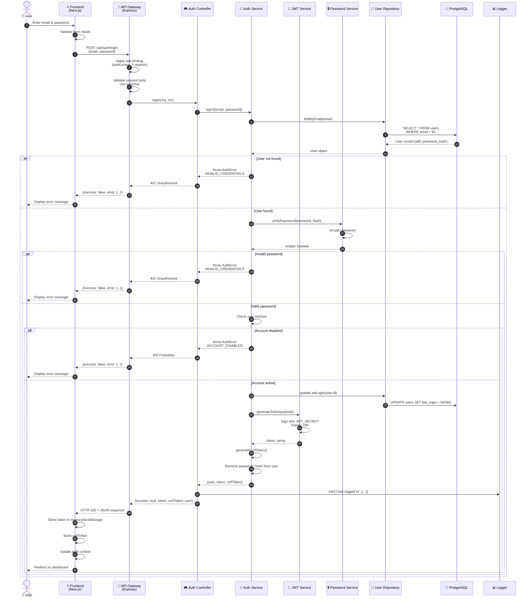
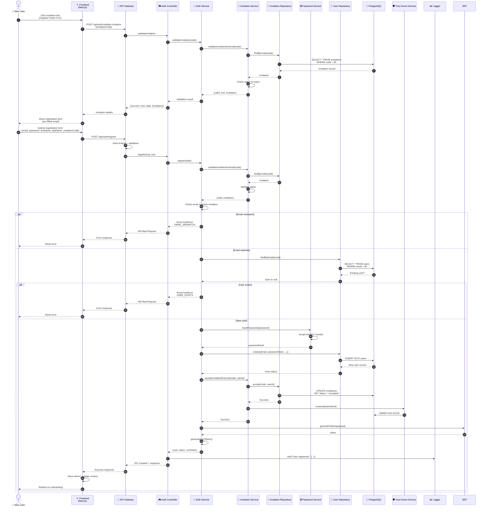
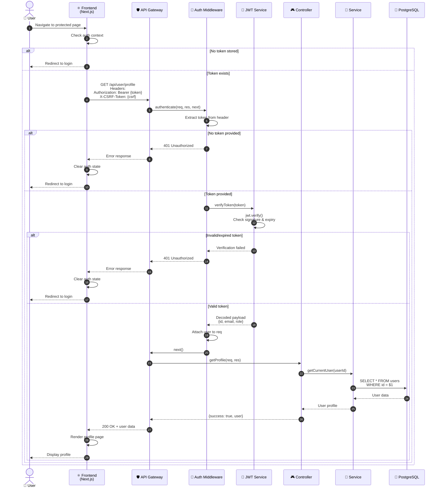
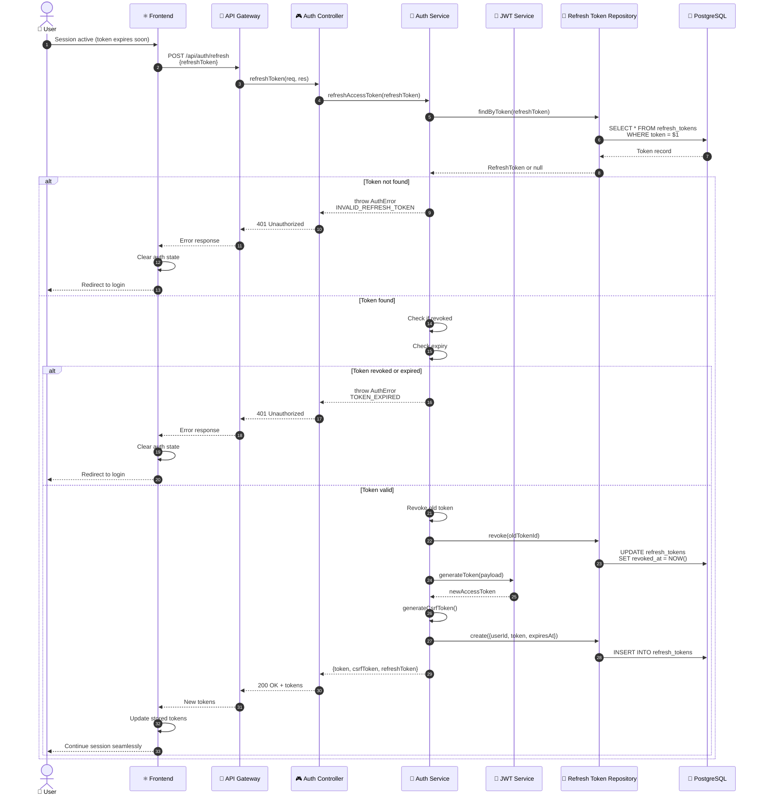

# MuslimEEN Authentication Flow

> Sequence diagrams showing login, registration, and authenticated request flows.

## Login Flow

## Registration Flow (Invitation-Based)

## Authenticated Request Flow

## Token Refresh Flow (Future Implementation)

## Security Features

| Feature | Implementation | Purpose |
|---------|----------------|---------|
| **JWT Tokens** | HS256 algorithm, 24h expiry | Stateless authentication |
| **CSRF Protection** | Double-submit cookie pattern | Prevent cross-site request forgery |
| **Rate Limiting** | 5 req/min for auth endpoints | Prevent brute force attacks |
| **Password Hashing** | bcrypt with 12 rounds | Secure password storage |
| **HTTPS Only** | All endpoints | Transport layer security |
| **Secure Headers** | Helmet.js | XSS, clickjacking protection |

## Error Codes

| Code | HTTP Status | Description |
|------|-------------|-------------|
| `INVALID_CREDENTIALS` | 401 | Email or password incorrect |
| `ACCOUNT_DISABLED` | 403 | User account deactivated |
| `INVALID_INVITATION` | 400 | Invitation code invalid/expired |
| `EMAIL_MISMATCH` | 400 | Email doesn't match invitation |
| `USER_EXISTS` | 400 | Account already exists |
| `TOKEN_EXPIRED` | 401 | JWT token has expired |
| `INVALID_TOKEN` | 401 | JWT token malformed |
| `CSRF_TOKEN_MISSING` | 403 | CSRF token not provided |
| `CSRF_TOKEN_INVALID` | 403 | CSRF token mismatch |
