# MuslimEEN Database Schema

> Entity Relationship Diagram showing all database tables and their relationships.

## ER Diagram

```mermaid
erDiagram
    USERS ||--o{ WORK_HISTORY : has
    USERS ||--o{ EDUCATION : has
    USERS ||--o{ TRUST_SCORE_HISTORY : tracks
    USERS ||--o{ INVITATIONS : sends
    USERS ||--o{ INVITATION_OUTCOMES : impacts
    USERS ||--o{ CONNECTIONS : requests
    USERS ||--o{ CONNECTIONS : receives
    USERS ||--o{ VERIFICATION_WITNESSES : verifies
    USERS ||--o{ VERIFICATION_WITNESSES : verified_by
    USERS ||--o{ MARKETPLACE_ITEMS : provides
    USERS ||--o{ DONATIONS : makes
    USERS ||--o{ QARD_HASAN_LOANS : borrows
    USERS ||--o{ QARD_HASAN_LENDERS : contributes
    USERS ||--o{ NOTIFICATIONS : receives
    USERS ||--o{ MESSAGES : sends
    USERS ||--o{ MESSAGES : receives
    USERS ||--o{ REFRESH_TOKENS : owns

    INVITATIONS ||--o{ INVITATION_OUTCOMES : tracks
    SADAQAH_CAMPAIGNS ||--o{ DONATIONS : receives
    QARD_HASAN_LOANS ||--o{ QARD_HASAN_LENDERS : funded_by

    USERS {
        uuid id PK "Primary Key"
        string email UK "Unique"
        string password_hash "Bcrypt hashed"
        string first_name
        string last_name
        string role "muslim_verified, muslim_unverified, non_muslim, business_provider"
        string verification_tier "basic, full, business"
        int trust_score "0-1000"
        text bio
        string location
        string industry
        array skills "TEXT[]"
        int endorsements
        int connections
        int profile_views
        boolean is_witness_eligible
        array badges "biometric, two_witness, business, institutional"
        timestamp created_at
        timestamp last_login
        timestamp updated_at
    }

    WORK_HISTORY {
        uuid id PK
        uuid user_id FK
        string company
        string title
        date start_date
        date end_date
        boolean current
        text description
        timestamp created_at
    }

    EDUCATION {
        uuid id PK
        uuid user_id FK
        string institution
        string degree
        date start_date
        date end_date
        timestamp created_at
    }

    TRUST_SCORE_HISTORY {
        uuid id PK
        uuid user_id FK
        int score "0-1000"
        jsonb factors "Score breakdown"
        timestamp recorded_at
    }

    INVITATIONS {
        uuid id PK
        string code UK "12 char unique"
        uuid inviter_id FK
        string invitee_email
        string status "pending, accepted, expired, revoked"
        timestamp created_at
        timestamp expires_at "+30 days"
        timestamp accepted_at
        uuid invitee_id FK
    }

    INVITATION_OUTCOMES {
        uuid id PK
        uuid invitation_id FK
        uuid inviter_id FK
        string outcome "success, banned, expired"
        int trust_impact
        timestamp processed_at
    }

    CONNECTIONS {
        uuid id PK
        uuid requester_id FK
        uuid recipient_id FK
        string status "pending, accepted, rejected, blocked"
        timestamp created_at
        timestamp accepted_at
    }

    VERIFICATION_WITNESSES {
        uuid id PK
        uuid user_id FK
        uuid witness_id FK
        string status "pending, approved, rejected"
        timestamp created_at
        timestamp witnessed_at
    }

    MARKETPLACE_ITEMS {
        uuid id PK
        string vertical "earn, build, live, protect"
        string category
        string subcategory
        uuid provider_id FK
        string title
        text description
        string location
        string rate
        string salary
        int seeking
        int raised
        string price
        string coverage
        int units
        int endorsements
        timestamp created_at
        timestamp updated_at
    }

    SADAQAH_CAMPAIGNS {
        uuid id PK
        string name
        string organization
        text description
        int goal "Target amount"
        int raised "Current amount"
        int donors
        date start_date
        date end_date
        string category "emergency, education, health, water, food, other"
        string image_url
        boolean verified
        timestamp created_at
    }

    DONATIONS {
        uuid id PK
        uuid campaign_id FK
        uuid donor_id FK
        decimal amount "10,2 precision"
        string currency "default GBP"
        boolean anonymous
        text message
        timestamp created_at
    }

    WAQF {
        uuid id PK
        string name
        string location
        text description
        decimal value "15,2 precision"
        decimal annual_income "15,2 precision"
        int beneficiaries
        timestamp created_at
    }

    QARD_HASAN_LOANS {
        uuid id PK
        uuid borrower_id FK
        decimal amount "10,2 precision"
        text purpose
        int term "Months"
        decimal repaid
        string status "funding, active, repaid, defaulted"
        timestamp created_at
    }

    QARD_HASAN_LENDERS {
        uuid id PK
        uuid loan_id FK
        uuid lender_id FK
        decimal amount "10,2 precision"
        timestamp contributed_at
    }

    NOTIFICATIONS {
        uuid id PK
        uuid user_id FK
        string type "connection_request, connection_accepted, endorsement_received, trust_score_changed, verification_completed, message_received, marketplace_interest, dispute_resolution"
        string title
        text message
        boolean read
        timestamp created_at
        uuid actor_id FK
        string actor_name
        int actor_trust_score
        string action_url
        jsonb data
    }

    MESSAGES {
        uuid id PK
        uuid sender_id FK
        uuid recipient_id FK
        text content
        boolean read
        timestamp created_at
    }

    REFRESH_TOKENS {
        uuid id PK
        uuid user_id FK
        string token UK
        timestamp expires_at
        timestamp created_at
        timestamp revoked_at
    }
```



## Table Descriptions

### Core User Tables

| Table | Purpose | Key Features |
|-------|---------|--------------|
| `users` | Main user accounts | Trust score (0-1000), roles, verification tiers |
| `work_history` | Professional experience | LinkedIn-style work history |
| `education` | Academic background | Degrees and institutions |
| `trust_score_history` | Trust score audit trail | JSONB factors for transparency |

### Invitation System

| Table | Purpose | Key Features |
|-------|---------|--------------|
| `invitations` | Invitation codes | 30-day expiry, unique 12-char codes |
| `invitation_outcomes` | Trust impact tracking | Success/failure affects inviter's trust |

### Network & Connections

| Table | Purpose | Key Features |
|-------|---------|--------------|
| `connections` | Professional network | Pending/accepted/rejected/blocked states |
| `verification_witnesses` | Two-witness verification | Community-based identity verification |

### Marketplace

| Table | Purpose | Key Features |
|-------|---------|--------------|
| `marketplace_items` | Four verticals (EARN/BUILD/LIVE/PROTECT) | Flexible schema for different listing types |

### Islamic Finance

| Table | Purpose | Key Features |
|-------|---------|--------------|
| `sadaqah_campaigns` | Charity campaigns | Verified flag for legitimacy |
| `donations` | Donation records | Anonymous option |
| `waqf` | Endowment assets | Annual income tracking |
| `qard_hasan_loans` | Interest-free loans | Funding/active/repaid/defaulted states |
| `qard_hasan_lenders` | Loan contributors | Multiple lenders per loan |

### Communication

| Table | Purpose | Key Features |
|-------|---------|--------------|
| `notifications` | User notifications | Rich notification types with actor info |
| `messages` | Direct messaging | Read receipts |

### Security

| Table | Purpose | Key Features |
|-------|---------|--------------|
| `refresh_tokens` | Token rotation | Expiry and revocation tracking |

## Indexes

```sql
-- User lookups
CREATE INDEX idx_users_email ON users(email);
CREATE INDEX idx_users_trust_score ON users(trust_score DESC);

-- Invitation lookups
CREATE INDEX idx_invitations_code ON invitations(code);
CREATE INDEX idx_invitations_inviter ON invitations(inviter_id);

-- Connection lookups
CREATE INDEX idx_connections_requester ON connections(requester_id);
CREATE INDEX idx_connections_recipient ON connections(recipient_id);

-- Marketplace lookups
CREATE INDEX idx_marketplace_vertical ON marketplace_items(vertical);
CREATE INDEX idx_marketplace_provider ON marketplace_items(provider_id);

-- Notification lookups
CREATE INDEX idx_notifications_user ON notifications(user_id);
CREATE INDEX idx_notifications_read ON notifications(user_id, read);

-- Trust score history
CREATE INDEX idx_trust_score_history_user ON trust_score_history(user_id);

-- Message lookups
CREATE INDEX idx_messages_sender ON messages(sender_id);
CREATE INDEX idx_messages_recipient ON messages(recipient_id);
```

## Triggers

```sql
-- Auto-update updated_at timestamp
CREATE TRIGGER update_users_updated_at 
    BEFORE UPDATE ON users
    FOR EACH ROW EXECUTE FUNCTION update_updated_at_column();

CREATE TRIGGER update_marketplace_items_updated_at 
    BEFORE UPDATE ON marketplace_items
    FOR EACH ROW EXECUTE FUNCTION update_updated_at_column();
```

## Constraints

### Check Constraints
- `users.trust_score`: `>= 0 AND <= 1000`
- `users.role`: `muslim_verified`, `muslim_unverified`, `non_muslim`, `business_provider`
- `marketplace_items.vertical`: `earn`, `build`, `live`, `protect`
- `connections.status`: `pending`, `accepted`, `rejected`, `blocked`

### Unique Constraints
- `users.email`
- `invitations.code`
- `connections(requester_id, recipient_id)`
- `verification_witnesses(user_id, witness_id)`
