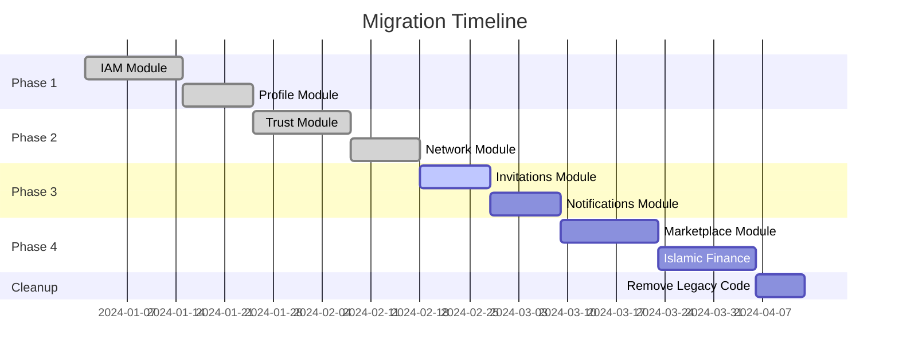
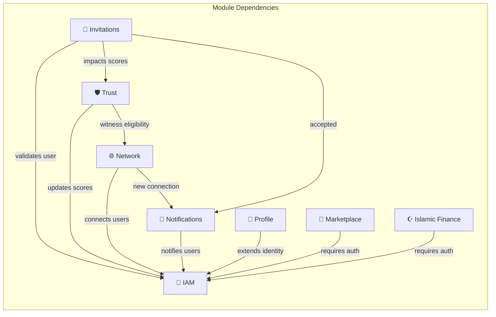
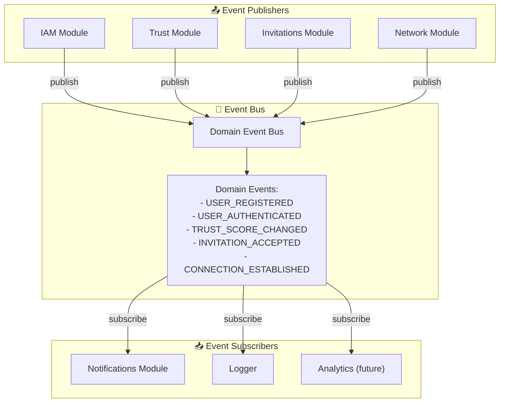

# MuslimEEN Module Architecture

> Diagram showing the modular architecture, legacy-to-modular migration, and feature flags.

## Module Architecture Overview

```mermaid
flowchart TB
    subgraph AppLayer["🚀 Application Layer"]
        Server["Express Server<br/>server.ts"]
        Routes["Route Definitions<br/>routes/index.ts"]
        Middleware["Global Middleware<br/>Security, CORS, Logging"]
    end

    subgraph LegacyLayer["📦 Legacy Layer (Pre-SRP)"]
        direction TB
        LegacyControllers["Legacy Controllers<br/>~1000+ line fat controllers"]
        LegacyServices["Legacy Services<br/>Mixed business logic"]
    end

    subgraph MigrationLayer["🔄 Migration Layer"]
        FeatureFlags["Feature Flags<br/>config/featureFlags.ts"]
        RouterSwitch["Router Switch<br/>Conditional routing"]
    end

    subgraph ModularLayer["📁 Modular Architecture (Post-SRP)"]
        direction TB
        
        subgraph IAM["🔑 IAM Module"]
            IAMCtrl["AuthController.ts"]
            IAMSvc["AuthService.ts"]
            IAMRepo["UserRepository.ts"]
            JWT["JwtService.ts"]
            Pwd["PasswordService.ts"]
        end
        
        subgraph Profile["👤 Profile Module"]
            ProfileCtrl["ProfileController.ts"]
            ProfileSvc["ProfileService.ts"]
            ProfileRepo["ProfileRepository.ts"]
        end
        
        subgraph Trust["🛡️ Trust Module"]
            TrustCtrl["TrustScoreController.ts"]
            VerifCtrl["VerificationController.ts"]
            TrustSvc["TrustScoreService.ts"]
            VerifSvc["VerificationService.ts"]
            TrustRepo["TrustScoreRepository.ts"]
            VerifRepo["VerificationRepository.ts"]
        end
        
        subgraph Network["🌐 Network Module"]
            ConnCtrl["ConnectionController.ts"]
            ConnSvc["ConnectionService.ts"]
            ConnRepo["ConnectionRepository.ts"]
        end
        
        subgraph Marketplace["🏪 Marketplace Module"]
            MarketCtrl["MarketplaceController.ts"]
            MarketSvc["MarketplaceService.ts"]
            MarketRepo["MarketplaceRepository.ts"]
        end
        
        subgraph IslamicFinance["☪️ Islamic Finance Module"]
            FinanceCtrl["IslamicFinanceController.ts"]
            FinanceSvc["IslamicFinanceService.ts"]
            FinanceRepo["IslamicFinanceRepository.ts"]
        end
        
        subgraph Invitations["📨 Invitations Module"]
            InviteCtrl["InvitationController.ts"]
            InviteSvc["InvitationService.ts"]
            InviteVal["InvitationValidationService.ts"]
            InviteRepo["InvitationRepository.ts"]
        end
        
        subgraph Notifications["🔔 Notifications Module"]
            NotifCtrl["NotificationController.ts"]
            NotifSvc["NotificationService.ts"]
            NotifRepo["NotificationRepository.ts"]
            EventHandlers["Event Handlers"]
        end
    end

    subgraph SharedLayer["🔗 Shared Layer"]
        direction TB
        SharedMiddleware["Middleware<br/>auth, validation, rateLimiter"]
        SharedUtils["Utilities<br/>logger, security, formatters"]
        EventBus["Event Bus<br/>Domain Events"]
        Database["Database Connection<br/>pool.ts"]
    end

    subgraph DataLayer["💾 Data Layer"]
        PostgreSQL["PostgreSQL<br/>Database"]
    end

    %% Connections
    Server --> Middleware
    Middleware --> Routes
    
    Routes --> MigrationLayer
    
    FeatureFlags --> RouterSwitch
    RouterSwitch -->|"useModularIAM = false"| LegacyControllers
    RouterSwitch -->|"useModularIAM = true"| IAM
    RouterSwitch -->|"useModularProfile = false"| LegacyControllers
    RouterSwitch -->|"useModularProfile = true"| Profile
    RouterSwitch -->|"useModularTrust = false"| LegacyControllers
    RouterSwitch -->|"useModularTrust = true"| Trust
    RouterSwitch -->|"useModularNetwork = false"| LegacyControllers
    RouterSwitch -->|"useModularNetwork = true"| Network
    RouterSwitch -->|"useModularMarketplace = false"| LegacyControllers
    RouterSwitch -->|"useModularMarketplace = true"| Marketplace
    RouterSwitch -->|"useModularIslamicFinance = false"| LegacyControllers
    RouterSwitch -->|"useModularIslamicFinance = true"| IslamicFinance
    RouterSwitch -->|"useModularInvitations = false"| LegacyControllers
    RouterSwitch -->|"useModularInvitations = true"| Invitations
    RouterSwitch -->|"useModularNotifications = false"| LegacyControllers
    RouterSwitch -->|"useModularNotifications = true"| Notifications
    
    LegacyControllers --> LegacyServices
    LegacyServices --> SharedLayer
    
    IAM --> SharedLayer
    Profile --> SharedLayer
    Trust --> SharedLayer
    Network --> SharedLayer
    Marketplace --> SharedLayer
    IslamicFinance --> SharedLayer
    Invitations --> SharedLayer
    Notifications --> SharedLayer
    
    SharedLayer --> DataLayer
    
    Notifications --> EventBus
    IAM --> EventBus
    Trust --> EventBus
    Invitations --> EventBus

    %% Styling
    style LegacyLayer fill:#ffcdd2
    style ModularLayer fill:#c8e6c9
    style MigrationLayer fill:#fff9c4
    style SharedLayer fill:#e1f5fe
```



## Module Structure Detail

### Standard Module Pattern

Each module follows the **Single Responsibility Principle (SRP)** with clear separation:

```
backend/src/modules/{module-name}/
├── index.ts                    # Public API exports
├── controllers/
│   └── {Feature}Controller.ts  # HTTP request/response handling
├── services/
│   └── {Feature}Service.ts     # Business logic
├── repositories/
│   └── {Feature}Repository.ts  # Database access
└── types/
    └── index.ts                # Module-specific types (optional)
```

### Module Comparison

| Aspect | Legacy (Pre-SRP) | Modular (Post-SRP) |
|--------|-----------------|-------------------|
| **Controller Size** | ~1000+ lines | ~100 lines |
| **Responsibilities** | Multiple (HTTP, validation, business logic) | Single (HTTP only) |
| **Testability** | Hard to unit test | Easy to mock and test |
| **Reusability** | Low | High (services are reusable) |
| **Maintainability** | Difficult | Clear boundaries |
| **Code Duplication** | High | Low (shared utilities) |

## Feature Flags Configuration

```mermaid
flowchart LR
    subgraph Env["🌍 Environment Variables"]
        I["USE_MODULAR_IAM"]
        P["USE_MODULAR_PROFILE"]
        T["USE_MODULAR_TRUST"]
        N["USE_MODULAR_NETWORK"]
        M["USE_MODULAR_MARKETPLACE"]
        F["USE_MODULAR_ISLAMIC_FINANCE"]
        IN["USE_MODULAR_INVITATIONS"]
        NO["USE_MODULAR_NOTIFICATIONS"]
    end

    subgraph Config["⚙️ Feature Flags Config"]
        FF["featureFlags.ts"]
    end

    subgraph Status["📊 Migration Status"]
        Check["isFullyMigrated()"]
        Report["getMigrationStatus()"]
    end

    Env --> Config
    Config --> Status
```



### Feature Flag Definitions

```typescript
// backend/src/modules/shared/config/featureFlags.ts

export const featureFlags = {
  useModularIAM: process.env.USE_MODULAR_IAM === 'true',
  useModularProfile: process.env.USE_MODULAR_PROFILE === 'true',
  useModularTrust: process.env.USE_MODULAR_TRUST === 'true',
  useModularNetwork: process.env.USE_MODULAR_NETWORK === 'true',
  useModularNotifications: process.env.USE_MODULAR_NOTIFICATIONS === 'true',
  useModularInvitations: process.env.USE_MODULAR_INVITATIONS === 'true',
  useModularMarketplace: process.env.USE_MODULAR_MARKETPLACE === 'true',
  useModularIslamicFinance: process.env.USE_MODULAR_ISLAMIC_FINANCE === 'true',
};

export const isFullyMigrated = (): boolean => 
  Object.values(featureFlags).every(flag => flag === true);

export const getMigrationStatus = (): Record<string, boolean> => 
  ({ ...featureFlags });
```

## Migration Path



## Module Dependencies



## Event Bus Integration



## Directory Structure

```
backend/src/
├── server.ts                      # Entry point
├── routes/
│   └── index.ts                   # Legacy routes
├── controllers/                   # Legacy controllers (being migrated)
│   ├── authController.ts
│   ├── userController.ts
│   └── ...
├── services/                      # Legacy services (being migrated)
│   ├── AuthService.ts
│   ├── UserService.ts
│   └── ...
├── middleware/                    # Legacy middleware
├── models/                        # Legacy models
├── types/                         # Global types
├── utils/                         # Legacy utilities
│
└── modules/                       # NEW MODULAR ARCHITECTURE
    ├── index.ts                   # Module exports
    ├── routes.ts                  # Modular route definitions
    │
    ├── iam/                       # Identity & Access Management
    │   ├── index.ts
    │   ├── controllers/
    │   ├── services/
    │   └── repositories/
    │
    ├── profile/                   # User Profile Management
    │   ├── index.ts
    │   ├── controllers/
    │   ├── services/
    │   └── repositories/
    │
    ├── trust/                     # Trust Score & Verification
    │   ├── index.ts
    │   ├── controllers/
    │   ├── services/
    │   └── repositories/
    │
    ├── network/                   # Connections & Networking
    │   ├── index.ts
    │   ├── controllers/
    │   ├── services/
    │   └── repositories/
    │
    ├── marketplace/               # EARN/BUILD/LIVE/PROTECT
    │   ├── index.ts
    │   ├── controllers/
    │   ├── services/
    │   └── repositories/
    │
    ├── islamic-finance/           # Sadaqah, Waqf, Qard Hasan
    │   ├── index.ts
    │   ├── controllers/
    │   ├── services/
    │   └── repositories/
    │
    ├── invitations/               # Invitation System
    │   ├── index.ts
    │   ├── controllers/
    │   ├── services/
    │   └── repositories/
    │
    ├── notifications/             # Notification System
    │   ├── index.ts
    │   ├── controllers/
    │   ├── services/
    │   ├── repositories/
    │   └── eventHandlers/
    │
    └── shared/                    # Shared module utilities
        ├── config/
        │   └── featureFlags.ts
        ├── middleware/
        ├── utils/
        └── events/
            └── EventBus.ts
```

## Benefits of Modular Architecture

| Benefit | Description |
|---------|-------------|
| **Single Responsibility** | Each class has one reason to change |
| **Testability** | Easy to mock dependencies and unit test |
| **Maintainability** | Clear boundaries reduce cognitive load |
| **Scalability** | Teams can work on modules independently |
| **Reusability** | Services can be shared across features |
| **Deployability** | Feature flags enable gradual rollout |
| **Debugging** | Easier to trace issues within modules |
