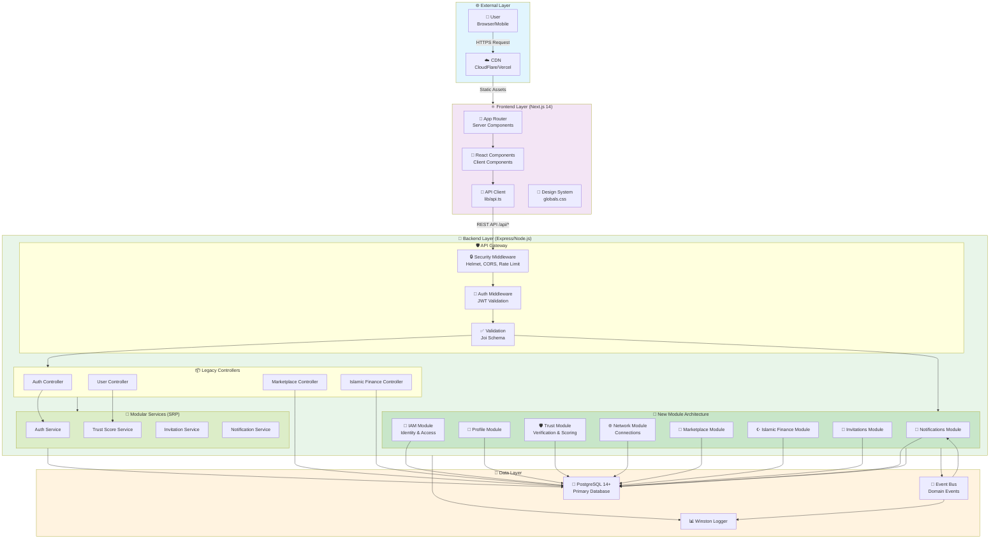
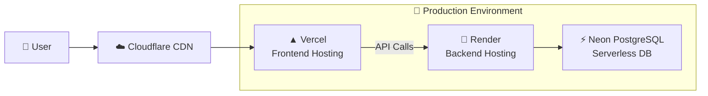

# MuslimEEN System Overview

> High-level architecture diagram showing the complete system structure and data flow.

## System Architecture Diagram

## Architecture Components

### 1. Frontend (Next.js 14)
| Component | Technology | Purpose |
|-----------|------------|---------|
| App Router | Next.js 14 App Router | Server-side rendering, routing |
| Components | React 18 | UI components with CSS variables |
| API Client | TypeScript/fetch | REST API communication |
| Styles | CSS Variables | Islamic geometric design system |

### 2. Backend (Express/Node.js)
| Component | Technology | Purpose |
|-----------|------------|---------|
| API Gateway | Express middleware | Security, auth, validation |
| Legacy Controllers | TypeScript | HTTP request handlers (being migrated) |
| Modular Services | TypeScript | Business logic (SRP compliant) |
| New Modules | TypeScript | Feature-based module architecture |

### 3. Database (PostgreSQL 14+)
| Feature | Description |
|---------|-------------|
| UUID Primary Keys | `uuid-ossp` extension |
| Relations | Foreign key constraints with CASCADE |
| Indexes | Performance-optimized indexes |
| Triggers | `updated_at` auto-timestamp |

### 4. Security Layer
| Component | Implementation |
|-----------|----------------|
| Authentication | JWT with 24h expiry |
| CSRF Protection | Double-submit cookie pattern |
| Rate Limiting | Per-endpoint limits |
| CORS | Whitelist-based origins |
| Helmet | Security headers |

## Data Flow

1. **User Request** → CDN (static) or API (dynamic)
2. **Frontend** → API Client with JWT + CSRF token
3. **Backend** → Security middleware → Auth middleware → Validation
4. **Controller** → Service → Repository
5. **Database** → PostgreSQL with relations
6. **Response** → JSON with user data
7. **Events** → EventBus → Notifications/Logging

## Deployment Architecture

## Technology Stack Summary

| Layer | Technology | Version |
|-------|------------|---------|
| Frontend | Next.js | 14.2.5 |
| Frontend | React | 18.3.1 |
| Frontend | TypeScript | 5.5.2 |
| Backend | Node.js | >= 18.0.0 |
| Backend | Express | 4.18.2 |
| Backend | TypeScript | 5.3.3 |
| Database | PostgreSQL | 14+ |
| Auth | JWT | jsonwebtoken |
| Validation | Joi | - |
| Logging | Winston | - |
